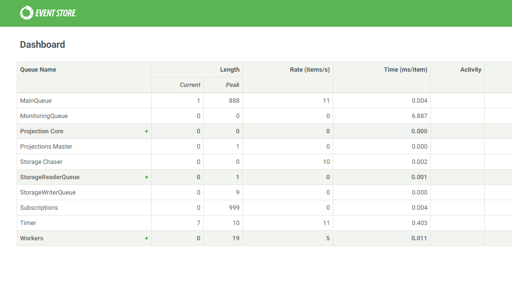

# ServiceStack.EventStore #

A plugin for [ServiceStack](https://servicestack.net/) that provides a [message gateway](http://www.enterpriseintegrationpatterns.com/patterns/messaging/MessagingGateway.html) to [EventStore](https://geteventstore.com/) streams.

By adding this plugin to an application such as a Windows service the application is able to connect to EventStore, subscribe to named [streams](http://www.enterpriseintegrationpatterns.com/patterns/messaging/MessageChannel.html), and handle [events](http://www.enterpriseintegrationpatterns.com/patterns/messaging/EventMessage.html) from EventStore as well as publish events to it according to the [message bus](http://www.enterpriseintegrationpatterns.com/patterns/messaging/MessageBus.html) pattern.

## Requirements ##

An instance of the EventStore server should be running on the network. Please follow the [installation](http://docs.geteventstore.com/introduction/) instructions provided by EventStore.

As detailed, you can verify that EventStore is running by browsing to port **2113** on the machine running the EventStore server:

 

## Getting Started ##

Add a reference to ServiceStack.EventStore in your project. 

Add the following to your `AppHost`

```csharp
        
	    public override void Configure(Container container)
        {
            var mappings = new HandlerMappings()
                                    .WithHandler<OrderCreatedHandler>()

            var settings = new EventStoreSettings()
                                    .ConsumerStream("event-stream")
                                    .PublisherStream("another-event-stream")
                                    .SubscriptionGroup("agroup")
                                    .SubscriptionType(SubscriptionType.Persistent)
                                    .InvalidMessageChannel("invalid-messages")
                                    .DeadLetterChannel("dead-messages")
                                    .StoreAndForward(StorageType.InMemory);

            var connection = new ConnectionBuilder()
                                    .UserName("admin")
                                    .Password("changeit")
                                    .Host("localhost:1113")
                                    .HeartbeatTimeout(500)
                                    .ReconnectionDelay(500);

            Plugins.Add(new EventStoreFeature(settings, mappings, connection));
        }
```

This code assumes that:

- Two streams with the name "event-stream" and "another-event-stream" exists in EventStore and the user with which you are connecting to EventStore has permissions to read events from them.
- EventStore is running on your local host. **1113** is the TCP port at which you can listen for events and **2113** is the HTTP port.

## Configuring the plugin ##

There are three classes that enable configuration of the plugin. 

### EventStoreSettings ###

`EventStoreSettings` provides a fluent API to configure the following settings:

- **Dead Letter Channel** - provides a [dead letter channel](http://www.enterpriseintegrationpatterns.com/patterns/messaging/DeadLetterChannel.html) to handle message that cannot be published to EventStore. The reasons for this can include a stream being deleted, a [message expiring](http://www.enterpriseintegrationpatterns.com/patterns/messaging/MessageExpiration.html), among others.
- **Subscription Group** - used when the subscription type is `Persistent`
- **Invalid Message Channel** - provides an [invalid message channel](http://www.enterpriseintegrationpatterns.com/patterns/messaging/InvalidMessageChannel.html) for messages that cannot be dispatched to a handler. 
- **Consumer Stream** - the stream from which the service consumes events.
- **Publisher Stream** - the stream to which the service publishes events.
- **Subscription Type** - the type of subscription to be used in connecting to the consumer stream. The options are `Persistent` (competing consumers model), `Volatile` (i.e. "read events from this moment forward"), and `CatchUp` (i.e. "read events from event number N onwards"). A discussion of these types can be found in the EventStore [documentation](http://docs.geteventstore.com/introduction/subscriptions/).
- **Storage Type** - the type of storage to be used in the [guaranteed delivery](http://www.enterpriseintegrationpatterns.com/patterns/messaging/GuaranteedMessaging.html) mechanism of store-and-forward. This can be either `ToDisk` or `InMemory`.  

### ConnectionBuilder ###

`ConnectionBuilder` provides a fluent API to generate the connection string that is used to connect to a running EventStore instance. 

- **Host Name** - the host (and TCP port) where EventStore can be found. By default this is "localhost:2113". Currently, this value is **mandatory**. However, once discovery is implemented this will be optional.  
- **User Name** - the name of the user with permissions to connect to EventStore. By default this is "admin". **Mandatory**.
- **Password** - the password of the user with permissions to connece to EventStore. By default this is "changeit". **Mandatory**. 
- **Reconnection Delay** - the delay before attempting to reconnect.
- **Heartbeat Timeout** - the amount of time to receive a heartbeat response before timing out.

### HandlerMappings ###

`HandlerMappings` notifies the plugin of which event handlers it should use when dispatching events that arrive from EventStore. These handlers implement `IHandle<TEvent>` where TEvent is a class that represents the event received from the stream:

```csharp

    public class OrderUpdatedHandler: IHandle<OrderUpdated>
    {
        public void Handle(OrderUpdated @event)
        {
            //interesting stuff
        }
    }
``` 


The developer can choose to map these handlers either explicitly through the fluent API of `HandlerMappings`:

```csharp

            var mappings = new HandlerMappings()
                                    .WithHandler<OrderCreatedHandler>()
                                    .WithHandler<OrderUpdatedHandler>();
``` 

Or the developer can choose to let the plugin use assembly-scannning to map all methods that implement `IHandle<TEvent>` to streamed events.